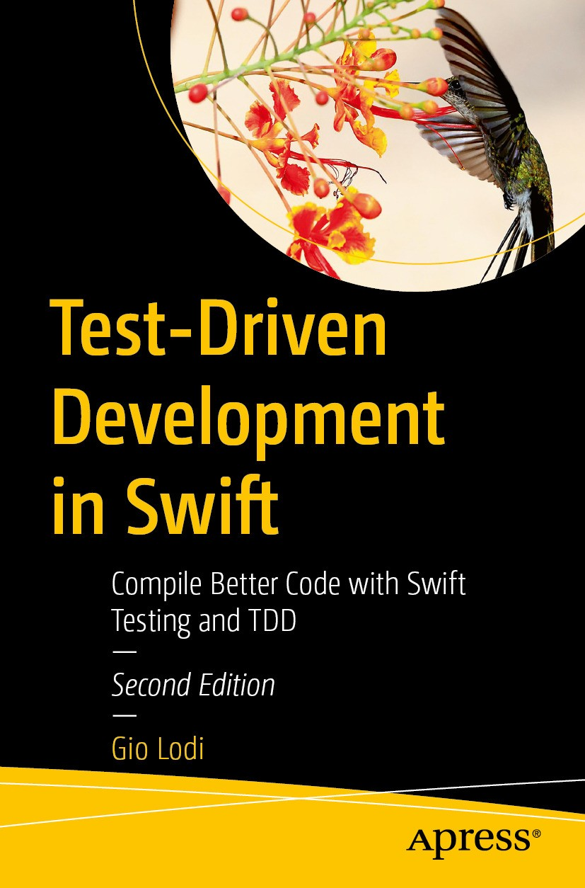

# Apress Source Code

This repository accompanies [*Test-Driven Development in Swift: Compile Better Code with Swift Testing and TDD*](https://link.springer.com/book/10.1007/979-8-8688-2637-5) by [Gio Lodi](https://giolodi.com) (Apress, 2026), Second Edition.

[comment]: #cover

Download the files as a zip using the green button, or clone the repository to your machine using Git.

## Releases

- Release v2.0.0 corresponds to the code in the published second edition, without corrections or updates.
- Release v1.0.0 corresponds to the code in the first edition (2021), without corrections or updates.

## Contributions

See [`Contributing.md`](./Contributing.md) for more information on how you can contribute to this repository.
